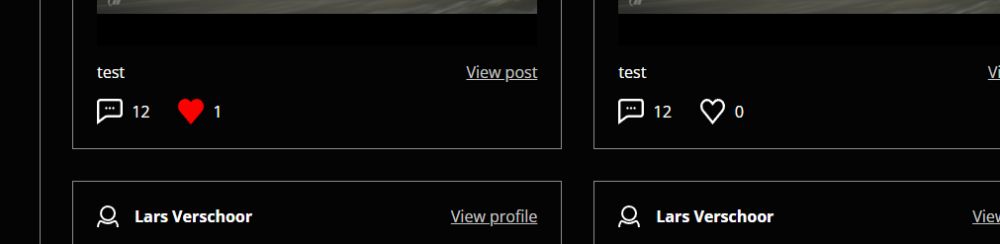
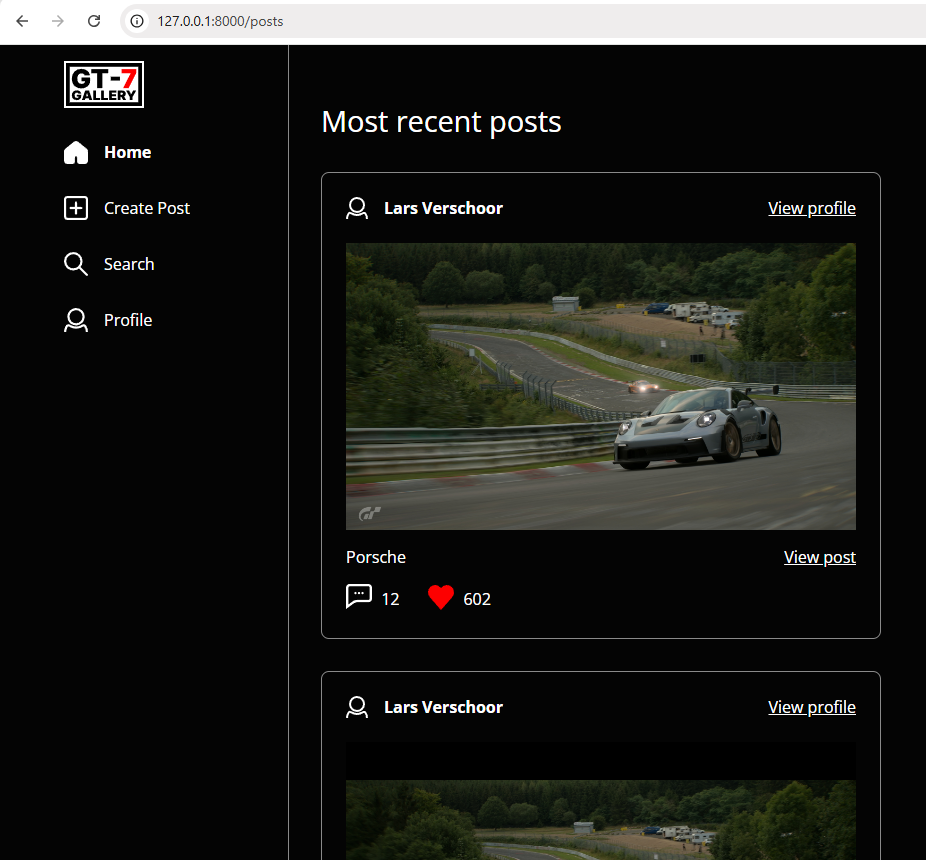
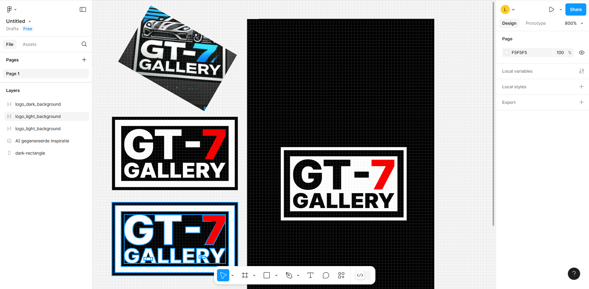

# ChangeLog

## 29-10-2024 Dinsdag

Ik heb vandaag het like systeem gemaakt (create, read, delete)

## 28-10-2024 Maandag

Ik heb vandaag de frontend gemaakt voor de posts pagina's, en een aantal icoontjes gemaakt voor het liken en commenten.

## 25-10-2024 Vrijdag

Ik heb vandaag een aantal fixes en updates gemaakt aan het post foto upload systeem, waaronder een controller method voor het ophalen van de post foto's.

Ik heb vandaag ook een logo gemaakt in figma en deze toegevoegd aan de navigatie.

Ik heb ook de css voor de navigatie geschreven.

## 24-10-2024 Donderdag

Ik heb vandaag de file uploads gemaakt voor de foto's die bij posts worden geupload.

## 22-10-2024 Dinsdag

Ik heb vandaag CRuD (nog geen u) functionaliteiten toegevoegd aan de posts, en heb de admin het recht gegeven om alle posts te verwijderen.

## 17-10-2024 Donderdag

Ik heb vandaag alle migrations van het ERD aangemaakt.

## 15-10-2024, Dinsdag

Ik heb vandaag voor de posts table een migration, model, controller en een resource router aangemaakt. Ik heb nu werkende posts index en posts detail pagina's.

## 13-10-2024, Zondag

Ik heb vandaag het ERD gemaakt in drawsql.app

## 10-10-2024, Donderdag

Ik heb vandaag het eindproject aangemaakt. Ik heb ook de breeze authenticatie geïnstalleerd.
